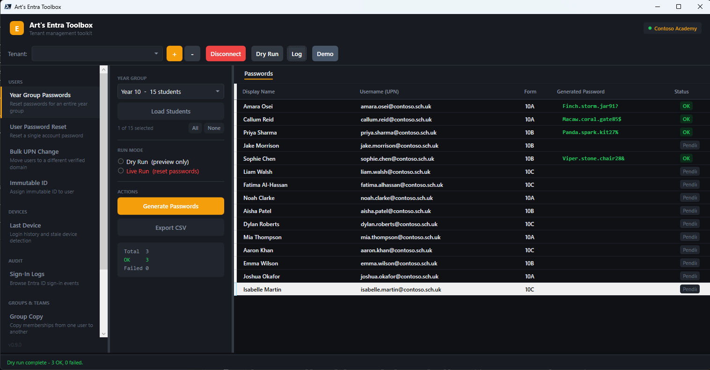
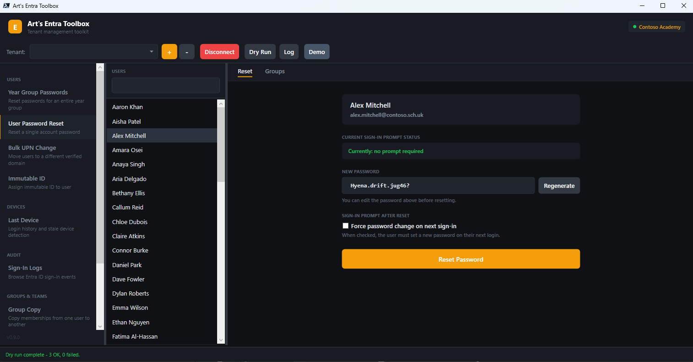
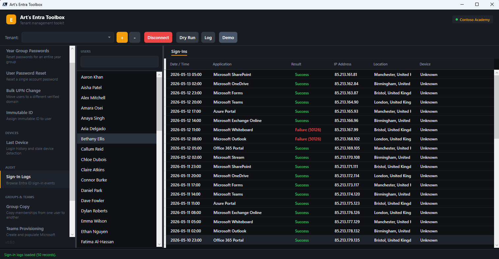
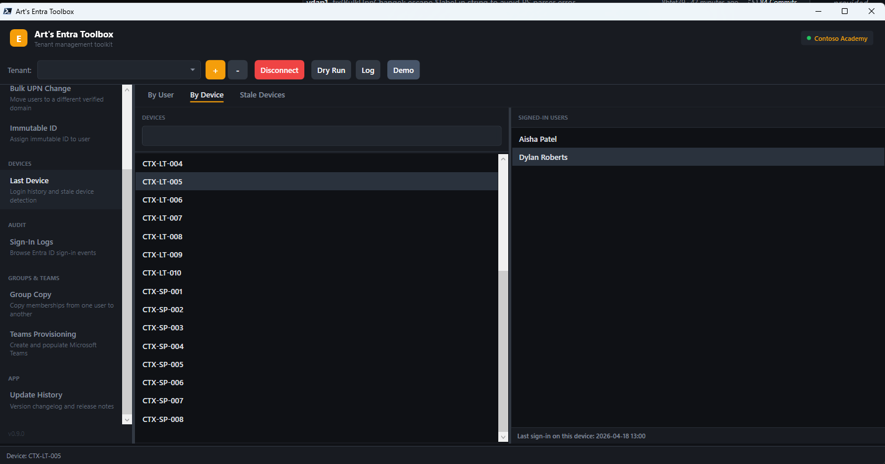

# Entra Toolbox

> **Note:** This tool was built for my own specific IT workflow managing school Entra ID tenants. It is published publicly for reference but may be completely useless for your use case.

WPF PowerShell GUI for Entra ID (Azure AD) tenant management. Requires Windows and [PowerShell 7](https://aka.ms/powershell).

## Tools

| Tool | Category | Description |
|------|----------|-------------|
| **Year Group Passwords** | Users | Bulk password reset by department. Memorable password generation, dry-run preview, CSV export. |
| **User Password Reset** | Users | Single-account password reset with live `forceChangePasswordNextSignIn` toggle and group membership view. |
| **Leaver Workflow** | Users | Disable account, revoke sign-in sessions, and remove from all groups in one click. Each step is individually togglable. Dry-run aware. |
| **Licence Assignment** | Users | View a user's assigned Microsoft 365 licences. Assign or remove individual SKUs. Shows available seats remaining per SKU. |
| **Bulk UPN Change** | Users | Move cloud-only users to a different verified domain. Import by department, office location, or individual search. |
| **Immutable ID** | Users | Assign or remove `onPremisesImmutableId` on cloud-only accounts. Per-row checkboxes, confirm-by-typing-YES safety gate. |
| **Last Device** | Devices | Intune device lookup by user or by device name. Stale device filter (7 / 30 / 60 / 90 days). Time Logs sub-tab. Export CSV reports (per device/user sign-in, or one row per device) of the users that signed into each device in the past 3 months. |
| **Device Compliance** | Devices | Overview of all Intune-managed device compliance states. Selecting a non-compliant device shows which policies are failing and how many settings are out of compliance. |
| **Sign-In Logs** | Audit | Last 50 sign-ins for any user — app, result, IP, location, device. |
| **Group Copy** | Groups & Teams | Copy all group memberships from one user to another. Skips groups the target already belongs to. |
| **Teams Provisioning** | Groups & Teams | Create a Class or Standard team, populate members from a year group or direct user search, assign per-person Owner roles. |
| **Secure Score** | Security | Microsoft Secure Score percentage headline with per-control breakdown table. |
| **Appearance** | App | Theme presets (Slate & Amber, Indigo Night, Ocean, Forest, Rose) and UI font picker with per-font preview. |

Multi-tenant. Profiles saved locally, token cache persisted across sessions — no re-authentication unless the refresh token expires. Access tokens are refreshed silently in the background during long sessions, and all Graph calls retry automatically on throttling and transient server errors.

## Usage

```batch
Launch.cmd
```

Downloads `MSAL.PS` automatically on first run. No admin rights required.

Add a tenant with the **+** button — enter a Tenant ID, a verified domain, or a global admin UPN (domains and UPNs are resolved to the tenant automatically), sign in interactively, done. Subsequent launches connect silently.

Use **Dry Run** in the tenant bar to preview destructive actions (password resets, UPN changes, ID assignments) without executing them.

Press **Ctrl+K** (or the **Search** button in the tenant bar) for global user search — type a name or UPN and jump straight to Password Reset, Devices, Sign-Ins, Licences, or Leaver for that user. Press **F1** for the keyboard shortcut guide. All tools share one cached user list per tenant, so switching tools is instant. The sidebar shows a notice when a newer version is available on GitHub.

## Permissions

Uses the Microsoft Intune PowerShell public client ID — no app registration required.

| Scope | Purpose |
|-------|---------|
| `User.ReadWrite.All` | Read users, reset passwords, change UPNs, set ImmutableId |
| `DeviceManagementManagedDevices.Read.All` | Last Device tab |
| `AuditLog.Read.All` | Sign-In Logs tab |
| `GroupMember.ReadWrite.All` | Group membership view and Group Copy tab |
| `Team.Create` | Create new Teams |
| `TeamMember.ReadWrite.All` | Add members and owners to Teams |
| `SecurityEvents.Read.All` | Secure Score tab |
| `User.RevokeSessions.All` | Leaver Workflow — invalidate active sessions |
| `DeviceManagementConfiguration.Read.All` | Device Compliance — fetch failing policy details |
| `LicenseAssignment.ReadWrite.All` | Licence Assignment — read tenant SKUs, assign/remove licences |

## Screenshots

**Year Group Passwords** — bulk password reset for an entire year group with dry-run preview and CSV export.



**User Password Reset** — reset a single account, regenerate passwords, and toggle forced sign-in prompt.



**Sign-In Logs** — browse the last 50 sign-in events for any user with app, result, IP, and location detail.



**Last Device (By Device)** — look up which users have signed into a specific device, with full sidebar navigation visible.



## License

MIT
